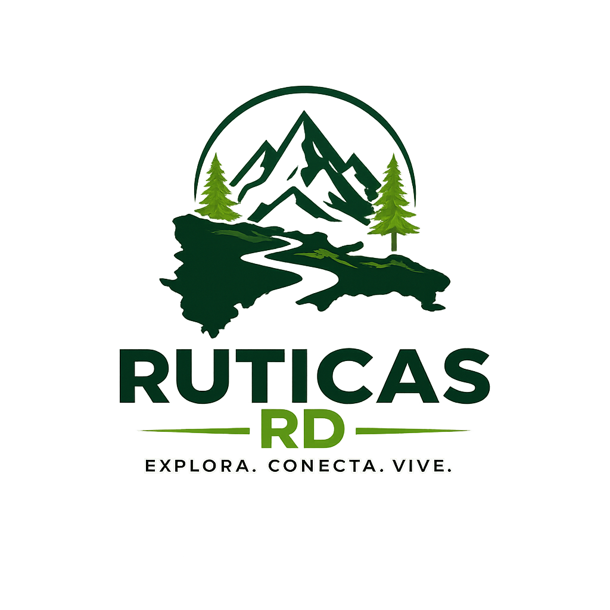
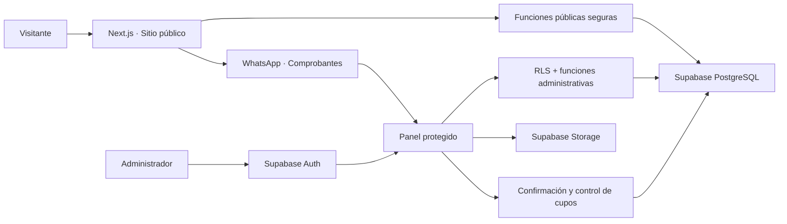

<div align="center">
  

  <h1>Ruticas RD</h1>

  <p>
    <strong>Explora. Conecta. Vive.</strong><br />
    Plataforma web para descubrir, reservar y administrar excursiones<br />
    y experiencias de naturaleza en República Dominicana.
  </p>

  <p>
    
    
    
    
    
    
  </p>
</div>

---

## La experiencia

Ruticas RD convierte el proceso completo de una excursión en un flujo sencillo:

```text
Descubrir un tour → Reservar cupos → Recibir un código
        → Transferir → Enviar comprobante por WhatsApp
        → Verificación administrativa → Cupos confirmados
```

Los visitantes no necesitan crear una cuenta. Cada reservación recibe un código único que permite consultar su estado sin exponer documentos, teléfonos ni datos privados de los participantes.

## Funcionalidades

### Sitio público

- Página principal con identidad visual de Ruticas RD.
- Catálogo dinámico de tours publicados.
- Detalle completo de cada excursión, precio y disponibilidad.
- Formulario de reservación para una persona o grupos.
- Registro individual de participantes y contactos de emergencia.
- Código único de reservación con opción para copiarlo.
- Correos automáticos al recibir la solicitud y al confirmar los cupos.
- Consulta pública y segura del estado mediante el código.
- Instrucciones de transferencia con cuentas bancarias configuradas.
- Envío del comprobante mediante WhatsApp, sin almacenar capturas.
- Galería organizada en carpetas por destino, información institucional, políticas y preguntas frecuentes.
- Diseño mobile-first adaptado a computadora, tableta y teléfono.

### Panel administrativo

- Inicio de sesión privado mediante Supabase Auth.
- Acceso limitado a perfiles `admin` activos.
- Creación, edición, publicación y administración de tours.
- Gestión de borradores, tours publicados y estados operativos.
- Carga de imágenes en Supabase Storage.
- Selección y cambio de portada del tour.
- Creación de carpetas de galería por destino, con publicación y asignación de fotografías.
- Listado de reservaciones con búsqueda, filtros y estadísticas.
- Detalle privado de responsables y participantes.
- Contacto directo con clientes por WhatsApp.
- Verificación manual de abonos y pagos.
- Confirmación, cancelación y finalización de reservaciones.
- Protección contra sobreventa al confirmar cupos.

### Reglas de capacidad

- Una solicitud nueva comienza como pendiente de verificación.
- Las solicitudes pendientes no consumen cupos públicos.
- Solo las reservaciones confirmadas o completadas descuentan disponibilidad.
- Para confirmar una reservación debe existir un abono o pago verificado.
- Al pasar una reservación a confirmada, se notifica al cliente; volver a guardar ese mismo estado no duplica el envío.
- La confirmación bloquea y valida la capacidad de forma atómica.
- Cancelar una reservación libera sus cupos automáticamente.

## Arquitectura



La aplicación utiliza Server Components, Server Actions y clientes de Supabase separados para navegador, servidor y proxy de autenticación.

## Tecnologías

| Área | Tecnología |
| --- | --- |
| Framework | Next.js 16 · App Router |
| Interfaz | React 19 · Tailwind CSS 4 |
| Lenguaje | TypeScript 5 |
| Base de datos | Supabase PostgreSQL |
| Autenticación | Supabase Auth |
| Archivos | Supabase Storage |
| Iconografía | Lucide React · React Icons |
| Despliegue | Vercel |
| Calidad | ESLint · TypeScript · Next.js Build |

## Estructura del proyecto

```text
RuticasRD/
├── app/                    # Rutas públicas, reservaciones y panel admin
│   ├── admin/              # Login y área administrativa protegida
│   ├── reserva/            # Consulta y confirmación por código
│   ├── reservar/           # Creación pública de reservaciones
│   └── tours/              # Catálogo y detalle de excursiones
├── components/             # Componentes de interfaz por dominio
├── data/                   # Contenido, políticas y configuración pública
├── docs/                   # Reglas de negocio y documentación del producto
├── lib/                    # Supabase, autenticación y lógica de dominio
├── public/                 # Marca, fotografías y recursos estáticos
├── supabase/               # Esquema, migraciones y bootstrap del administrador
└── types/                  # Modelos TypeScript compartidos
```

## Instalación local

### Requisitos

- Node.js `20.9.0` o superior.
- npm.
- Un proyecto de Supabase.

### 1. Clonar e instalar

```bash
git clone https://github.com/Raelvis19/RuticasRD.git
cd RuticasRD
npm install
```

### 2. Configurar las variables

Copia `.env.example` como `.env.local` y completa:

```env
NEXT_PUBLIC_SUPABASE_URL=https://tu-proyecto.supabase.co
NEXT_PUBLIC_SUPABASE_PUBLISHABLE_KEY=tu-clave-publicable
NEXT_PUBLIC_SITE_URL=https://ruticasrd.com
RESEND_API_KEY=re_tu-clave-de-resend
RESERVATION_EMAIL_FROM="Ruticas RD <no-responder@ruticasrd.com>"
```

| Variable | Uso |
| --- | --- |
| `NEXT_PUBLIC_SUPABASE_URL` | URL pública del proyecto de Supabase. |
| `NEXT_PUBLIC_SUPABASE_PUBLISHABLE_KEY` | Clave publicable usada por los clientes protegidos con RLS. |
| `NEXT_PUBLIC_SITE_URL` | Dominio público usado en los enlaces del correo. |
| `RESEND_API_KEY` | Clave privada de Resend para enviar confirmaciones. Solo se usa en el servidor. |
| `RESERVATION_EMAIL_FROM` | Remitente autorizado del dominio verificado en Resend. |

No agregues una clave `service_role`, `secret` o `RESEND_API_KEY` al navegador ni al repositorio.

### 3. Preparar Supabase

En un proyecto nuevo, ejecuta desde el SQL Editor y en este orden:

1. `supabase/001_initial_schema.sql`
2. `supabase/migrations/202608120001_harden_admin_access.sql`
3. `supabase/migrations/202608120002_tour_images_storage.sql`
4. `supabase/migrations/202608120003_fix_tour_cover.sql`
5. `supabase/migrations/202608120004_public_tours_and_reservations.sql`
6. `supabase/migrations/202608120005_reservation_management.sql`
7. `supabase/migrations/202608130001_gallery_management.sql`
8. `supabase/migrations/202608150001_tour_capacity_and_statuses.sql`
9. `supabase/migrations/202608150002_reservation_participant_order.sql`
10. `supabase/migrations/202608150003_payments_and_receipts.sql`
11. `supabase/migrations/202608150004_expenses.sql`
12. `supabase/migrations/202608170001_gallery_collections.sql`

Las migraciones crean las políticas de seguridad, los buckets de imágenes y comprobantes, las funciones públicas de reservación, el flujo administrativo de confirmación de cupos y las carpetas de galería por destino.

### 4. Crear el primer administrador

1. Abre `Authentication → Users` en Supabase.
2. Crea el usuario administrativo y copia su UUID.
3. Abre `supabase/bootstrap-first-admin.sql.example`.
4. Reemplaza el UUID y el nombre de ejemplo.
5. Ejecuta la consulta en el SQL Editor.

No existe registro público de administradores. El acceso requiere simultáneamente:

```text
Usuario autenticado + profile.role = admin + profile.is_active = true
```

El panel estará disponible en:

```text
http://localhost:3000/admin
```

### 5. Ejecutar el proyecto

```bash
npm run dev
```

Abre [http://localhost:3000](http://localhost:3000).

Para probar desde otro dispositivo conectado a la misma red:

```bash
npm run dev:network
```

Consulta [docs/iphone-local-development.md](./docs/iphone-local-development.md) para la guía de pruebas móviles en red local.

## Comandos disponibles

| Comando | Descripción |
| --- | --- |
| `npm run dev` | Inicia el entorno local. |
| `npm run dev:network` | Expone el servidor en la red local. |
| `npm run lint` | Ejecuta ESLint. |
| `npm run build` | Valida TypeScript y genera el build de producción. |
| `npm run start` | Inicia el build de producción. |

Antes de publicar cambios:

```bash
npm run lint
npm run build
```

## Despliegue en Vercel

1. Importa el repositorio en Vercel.
2. Confirma que el framework detectado sea Next.js.
3. Agrega las variables de Supabase y Resend en `Settings → Environment Variables`.
4. Habilítalas para `Production` y `Preview`.
5. Ejecuta un nuevo despliegue.
6. Configura el dominio final como `Site URL` en Supabase Auth.
7. Agrega el dominio a las URL de redirección permitidas.

> Las variables `NEXT_PUBLIC_*` se integran durante el build. Después de cambiarlas en Vercel es necesario volver a desplegar.

La confirmación por correo se envía únicamente después de que Supabase devuelve
un código de reservación válido. El envío usa ese código como clave de
idempotencia para evitar correos duplicados si se repite una solicitud.

## Seguridad y privacidad

- Row Level Security protege la información administrativa.
- La clave publicable no concede privilegios de administrador por sí sola.
- El panel comprueba la sesión y el perfil administrativo activo.
- Los visitantes solo pueden consultar tours publicados.
- La búsqueda por código devuelve un resumen deliberadamente limitado.
- Documentos, teléfonos, nombres y contactos de emergencia no se exponen en la consulta pública.
- La confirmación de cupos se realiza dentro de una función transaccional.
- Las capturas de pagos se envían por WhatsApp y no ocupan Supabase Storage.
- Los datos bancarios se mantienen en la configuración pública del proyecto.

## Documentación del producto

- [Project brief](./docs/project-brief.md)
- [Reglas de negocio](./docs/business-rules.md)
- [Inventario de contenido](./docs/content-inventory.md)
- [Revisión mobile-first](./docs/mobile-first-review.md)
- [Decisiones pendientes](./docs/pending-decisions.md)

## Roadmap

- [x] Sitio público responsive.
- [x] Catálogo y detalle dinámico de tours.
- [x] Reservaciones públicas para personas y grupos.
- [x] Código y consulta pública de reservación.
- [x] Datos bancarios y comprobantes por WhatsApp.
- [x] Autenticación y panel administrativo.
- [x] CRUD de tours e imágenes en Storage.
- [x] Gestión y confirmación manual de reservaciones.
- [x] Capacidad pública basada en cupos confirmados.
- [ ] Registro e historial detallado de pagos.
- [ ] Dashboard administrativo con métricas reales.
- [ ] Exportación de participantes y listas de transporte.
- [ ] Lista de espera operativa.
- [ ] Notificaciones y recordatorios.

## Contacto

- Instagram: [@ruticasrd](https://www.instagram.com/ruticasrd)
- Correo: [ruticasrd@yahoo.com](mailto:ruticasrd@yahoo.com)
- Ubicación: San Francisco de Macorís, República Dominicana

---

<div align="center">
  <strong>Hecho para explorar República Dominicana, una aventura a la vez. 🇩🇴</strong>
</div>
